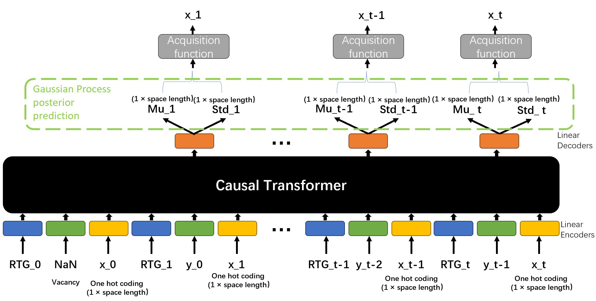

# Decision_Transformer_GP

Our project aims to have the Decision Transformer model find the extreme points of an unknown target function by learning the data collection strategy of a Gaussian process through offline learning. The target functions in our experiment are generated by other Gaussian Process.

We developed three model variants, their architectures are shown below:

## To generate the dataset to train/test these model, there are two steps. 

First, generate target functions and expert/random observation sequence:

Run __Trajectory_generation.ipynb__,  the save path, sequence length, number of target function, number of sequences and trade-off coefficient are set in the frst code cell.

Next, define trajectory reward and convert sequence to trajectory dataset format.

Run __python Sequence_generation.py sequense_save_path dataset_save_path timestep_penalty_value__.

## To traing model

Run __python train_variantX.py dataset_save_path model_save_path__, The training hyper-parameters are set in the train_variantX.py

## To validate/test model

Run __python validation_variantX.py dataset_save_path model_save_path timestep_penalty_value sequense_save_path__, the dataset_save_path should correspond to sequense_save_path.

## Evaluation result

Evaluation result example for each checkpoint is shown below, the score refers to the normalized historical max value at current timestep.

